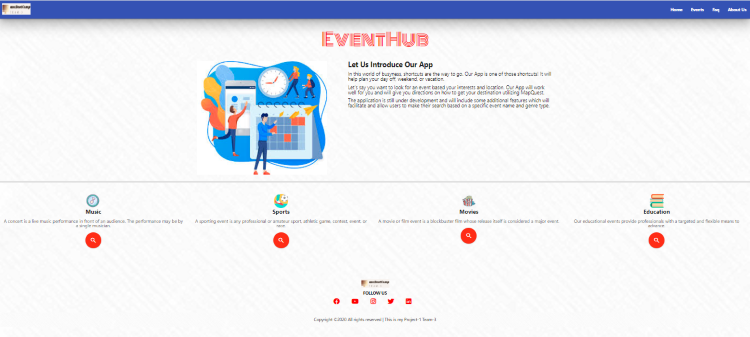
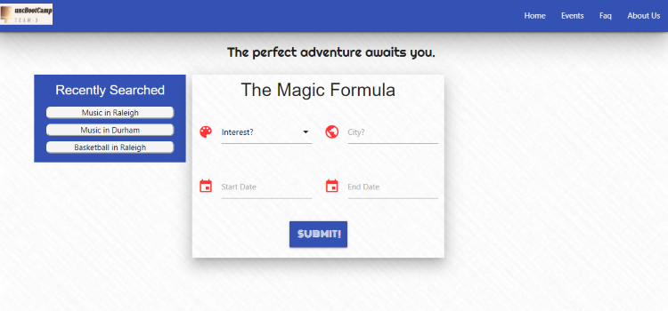
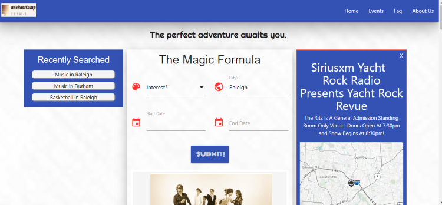
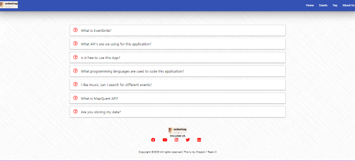
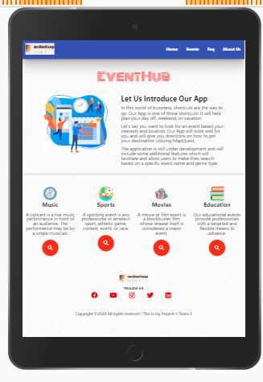

### EventHub

# Team3
    * Asad Ruaf
    * Jasmin Rowdy
    * Keshav Avva
    * Karna Cutolo

**Description:**

In this world of busyness, shortcuts are the way to go.  Our App is one of those shortcuts!  It will help plan your day off, weekend, or vacation.  

This application will allow you enter your interests and a city and it will return all the ticketed events from your search.  It will save your previous search history and allow you to re-search them at will. 

**Requirements met:**

1. Use of at least, two server-side API's (Ticketmaster, MapQuest) 
2. Use of a CSS framework other than BootStrap (Materialize)
3. Must be interactive
4. Use of at least one new 3rd Party API (Lodash)
5. Good Quality Coding Standards
6. Polished UI

**Technologies Used:**

    * HTML, JavaScript, jQuery, Materialize
    * Ticketmaster API, MapQuest API, LoDash API

**Potential Areas for Development:**

As we are in the infancy of its development, the opportunities for growth are plentiful.  

1. We can build the platform utilizing other API's
2. We can offer the option of linking to purchasing agents
3. We can potentially offer demographics to promoters for future events.

### File List:

1. Index.html
    
    Landing Page  

2. Script.js    
    
    Javascript for Landing Page and History list

3. Eventapp.html      

    Main Page

4. Events.js 

    Javascript for Main Page

5. Faq.html  

    Most frequently asked questions
   
6. Style.css         

    Stylesheet for Landing Page, Faq Page

7. Eventapp.css

    Stylesheet for Main Page

8. More.html

    About the Developers

9. More.css

    Stylesheet for More Page

10. More.js

    Javascript for More Page

8. Reset.css

    Compressed set of CSS rules that resets the styling of all HTML elements to a consistent baseline.

Link to site

# https://karna1014.github.io//

## Landing Page                            

   

## Main Page
   

## Main Page w/ More Info                  

 

## Faq Page

## Responsive Image I-Pad                  

 

